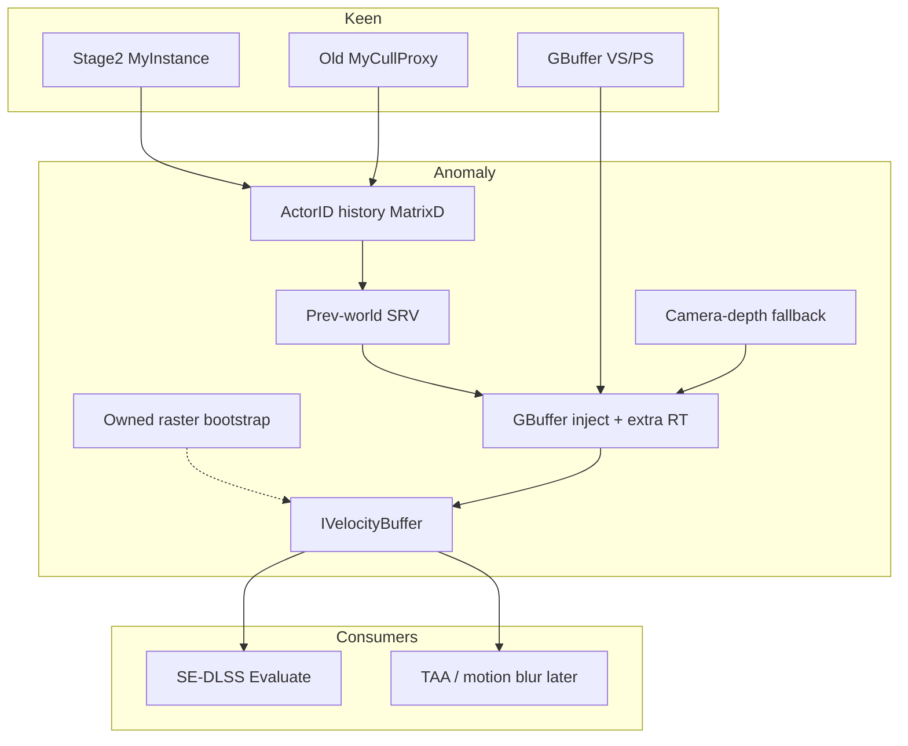

# Anomaly — Shader Framework Plan

Pulsar client plugin that intercepts Space Engineers 1’s DX11 geometry shaders and publishes shared GPU buffers. First product: a real velocity buffer. First consumer: [SE-DLSS](https://github.com/PhoenixTheSage/SE-DLSS).

This document is the product plan (why velocity, Keen facts, phases). Related docs:

- [ROADMAP.md](ROADMAP.md) — velocity + hook implementation order
- [Extensibility.md](Extensibility.md) — post-velocity framework (inject, slots, bind, catalog)
- [ShaderAPI.md](ShaderAPI.md) — compile hook, inject vs replace, named stages
- [ShaderPacks.md](ShaderPacks.md) — Pulsar named assets and third-party HLSL packs
- [KeenShaders.md](KeenShaders.md) — Keen HLSL inventory

DLSS keeps jitter, `SetDRS`, NGX evaluate, and HDR/LDR color. Anomaly **produces** velocity (and later other buffers). SE-DLSS only binds what Anomaly hands it.

## Current repo state

`T:\Cursor Projects\Anomaly` is the Anomaly shader-framework plugin. Slices A–J and L are in this repo. Slice G (SE-DLSS bind) is shipped and proven in the consumer repo. Slice K (sample pack plugin) is deferred. PluginHub registration is deferred.

- **SE-DLSS** stays the consumer in its own repo. Do not compile Anomaly sources into SE-DLSS or the reverse.
- Keep Harmony, publicizer, `VRage.Render11` access, settings/deploy/Pulsar XML shape, Rich HUD coexistence patterns.
- PluginHub id is `A9C29274-E447-49EE-881B-C980E6D190FD`. Do not reuse SE-DLSS’s id (`B6469FEE-…`).
- GPU work is C# D3D11 (SharpDX). Camera-MV HLSL lives in `Assets/Shaders/`. `Native/AnomalyGfx` is deferred.
- The link to consumers is a well-known interface + Pulsar `<DependencyIds>`.

## Goal

```
Keen GBuffer draw  ──inject──►  extra RG16F velocity  ──►  IVelocityBuffer
ActorID history    ──SRV────►  GBuffer VS (movers)
Camera-from-depth  ──fill───►  background / fallback
SE-DLSS / others   ──bind───►  VelocityRegistry.Active
```

**Runtime target:** write velocity during Keen’s existing GBuffer pass (piggyback).  
**Bootstrap:** a plugin-owned depth-tested object raster, only until compile + RT hooks exist.  
Do not keep both as the long-term design.

---

## Why this cut

Keen has no previous-world matrix and no object-ID GBuffer. Camera-reprojected depth (what SE-DLSS ships today) is correct for a static world under a moving camera. Moving grids ghost.

Two ways to fill object velocity:

| Path | GPU cost | Coverage | When |
|------|----------|----------|------|
| **GBuffer piggyback** | Extra VS math + one `RG16F` MRT on a pass already paid | Exact pixels Keen accepted | Framework target |
| **Owned object raster** | Second transform + raster of movers (or all geo) | Easy to miss LOD / decals / alpha; depth-equality risk | Bootstrap only |

Piggyback is cheaper in the scenes that matter (a moving megaship filling the view). An owned raster inside Anomaly is still a second scene pass; the framework being larger does not make that pass free. It only makes the GBuffer write *possible*.

An owned pass is also the wrong long-term buffer for TAA / motion blur / DLSS: those want the same pixels GBuffer wrote, not a second renderer’s approximation.

---

## Keen facts (do not rediscover)

SE runs **two** geometry pipelines every frame. History must cover both.

### Frame order

```
DrawScene
  └─ DrawGameScene
       ├─ PrepareGameScene          // frame CBs
       └─ MyRenderScheduler.Init    // cull queries, both renderers
       └─ Execute
            FrustumCull
            MyGeometryRenderer.UpdateMatrices     ★ Stage 2 snapshot
            Prepare / PerformCopy                 // instance VB upload
            MyGeometryRendererOld.UpdateCullProxies ★ old snapshot
            Stage 2 + old GBuffer draws           ★ inject / bind extra RT
       └─ MyRenderScheduler.Done
       └─ DrawGameScene postfix                   ★ swap current → previous
```

### Transforms (current only)

| Path | Storage | Translation | Previous? |
|------|---------|-------------|-----------|
| Stage 2 `MyTransformStrategy.RowMatrix` | 3×4 in instance VB (`MyVbConstantElement`, 64 B) | Camera-relative in `.W` | No |
| Old `MyObjectDataCommon` | Object CB via `UpdateObjectBuffer` | Camera-relative | No |
| Merge `MyPerInstanceData` | SRV | **Absolute** world | No |
| Static group VB | Immutable bake | Absolute; zero object motion while static | No |
| `MyActor.LastWorldMatrix` | Source of truth | Absolute `MatrixD` | Overwritten in place |

`MyInstance.UpdateWorldMatrix` runs per instance **per view**. Do not hook it. Snapshot after `UpdateMatrices` / `UpdateCullProxies`. Key by `ActorID` (`uint`), never VB slot (cull reorders).

Store **absolute `MatrixD`** in Anomaly. Camera-relative previous rows are wrong after the camera moves. Convert to 3×4 only when packing a GPU buffer.

### GBuffer shaders (source on disk)

Full catalog: [KeenShaders.md](KeenShaders.md). Not workshop `.sbc` materials. Keen’s geometry programs under the game install:

- `Content/Shaders/Geometry/Materials/` — `Standard`, `AlphaMasked`, `Glass`, `Triplanar*`, `Shield*`, …
- `Content/Shaders/Geometry/Passes/GBuffer/VertexStage.hlsli`
- `Content/Shaders/Geometry/Passes/GBuffer/PixelStage.hlsli`
- `Content/Shaders/GBuffer/GBufferWrite.hlsli`
- `Content/Shaders/Geometry/VertexTemplateBase.hlsli` — current instance matrix only; `position_clip = mul(position_local, view_proj)`

`GbufferOutput` is three targets (color/LOD, normals/AO, metal/gloss/emissive). No velocity, no object ID.

Passes: GBuffer `0`, Depth `1`, Forward `2`, Highlight `3`, foliage / transparent / decals after that. Inject **GBuffer only**. Depth must stay 3-attachment-free.

### Instance layout — do not widen

`MyColorPreparePass0.MyVbConstantElement` is 64 bytes (48 matrix + 16 color). Shared with depth packing. Do **not** add `PrevRowMatrix` to Keen’s VB.

Anomaly owns a **side SRV** packed in draw order (`SV_InstanceID` / merge `instanceIndex`). GBuffer VS loads previous world from that SRV. Statics skip the load: `mul(worldPos, PrevViewProj)` is camera motion.

---

## Public API (NGX-free)

Folder: `ClientPlugin/Velocity/`. No `NgxHost`, no `DlssRuntime` types.

| Type | Role |
|------|------|
| `VelocityConvention` | `Unjittered`, `PixelSpace`, `MatchesRenderResolution`. Y-down D3D. Document units: **pixel delta** at internal (DRS) resolution. |
| `IVelocityBuffer` | `IsAvailable`, native resource / `ISrvBindable`, `Width`/`Height`, `Convention`, `HistoryValid` |
| `VelocityRegistry` | `Active` = this plugin’s built-in producer. Consumers resolve by well-known interface name (reflection), not a compile-time reference to Anomaly. |
| `IVelocityHistory` | Snapshot/swap for implementors. Not required for consumers. |

**SE-DLSS consume site:** `DlssRuntime.TryEvaluate` (`GenerateCameraMotionVectors` today). Switch to `VelocityRegistry.Active` when Anomaly is present; otherwise keep the camera-native path.

Config on Anomaly:

- `VelocitySource`: `GBuffer` (target) \| `CameraOnly`
- `DebugVelocity` / `DebugVelocityScale`: false-color overlay of the published buffer (mid-gray = rest; magenta = invalid history)
- Status: source, history actor count, whether GBuffer injection is live, debug overlay on/off

PluginHub (when ready to register):

- SE-DLSS: `<DependencyIds>` → Anomaly’s id; optional, with camera-only fallback if missing

Document the contract in `ClientPlugin/Velocity/README.md` (interface + convention + “set or discover `IVelocityBuffer` before first draw”).

NVIDIA flags for consumers (not Anomaly create flags): `MVJittered` off, `MVLowRes` on. Texture: render-resolution `RG16F` (or `RGBA16F` if a fourth channel is needed later).

---

## Architecture



### GBuffer piggyback (target)

1. Intercept Keen shader compile (include path / define / bytecode swap). Prefer **include injection** over forking every file under `Materials/`.
2. Hook `MyGBufferPass.Begin` (SE-DLSS already prefixes this for view-proj): bind extra RT + history SRV.
3. Inject into the **shared** stages only:
   - `GBuffer/VertexStage.hlsli` — velocity interpolant
   - `GBuffer/PixelStage.hlsli` + `GBufferWrite.hlsli` — `SV_Target3`
4. Frame CB: unjittered current and previous view-proj (SE-DLSS `Jitter` already tracks these; Anomaly must own its own copy once DLSS is not loaded).
5. First frame / new `ActorID` / teleport (`WorldMatrixIndex` jump): write camera MV only (or leave the camera-pass background). Never write a zero buffer — zero + jittered raster is the stand-still sparkle class.

### Owned object raster (bootstrap only)

Fullscreen camera reprojection from `ResolvedDepthStencil`, then depth-tested draw of visible **dynamic** meshes with Anomaly VS/PS: current and previous world × unjittered view-proj → pixel delta. Dilate closest-depth (reversed-Z) after.

Skip static groups, clipmap rebuilds, GPU particles. Optional: skip actors whose current vs previous matrix is under a threshold.

Retire this path when piggyback is live. Running both is the expensive combination.

### Snapshot timing

| When | What |
|------|------|
| After `MyGeometryRenderer.UpdateMatrices` | Stage 2 visible instances: `Owner.LastWorldMatrix`, key `ActorID` |
| After `MyGeometryRendererOld` cull-proxy update | Old proxies, same actor id |
| After skinning upload when `SkinningMatrices != null` | Previous bones (`SetAnimationBones` → t16 SRV) |
| `DrawGameScene` postfix | Swap current → previous; drop ids not seen for N frames |

Do not hook `MyInstance.UpdateWorldMatrix`. Do not use VB index as a key.

---

## Phases

### 0 — Rebuild the copy into Anomaly

Phase 0 is done. Slice A (compile intercept) is implemented: `ANOMALY=1` + include dir on `MyShaderCompiler`. Velocity RT and GBuffer inject are later slices.

- [x] New identity: assembly, `Plugin.Name`, `Anomaly.xml` (repo, friendly name, tooltip), README. New GUID; do not reuse the SE-DLSS PluginHub id.
- [x] Windows only.
- [x] Delete NGX load, `nvngx_dlss.dll`, DLSS settings, DRS / evaluate / AA patches, and DLSS-only native exports. Keep Harmony + publicizer + `VRage.Render11`.
- [x] Re-home folders (`ClientPlugin/Dlss` → `Velocity` / `Shaders` / framework hosts). Leave a compile-and-load stub before adding intercepts.
- [x] Native: Keen blit + C# D3D11 (SharpDX already referenced). No NGX types. `Native/AnomalyGfx` deferred until a C++ helper is actually needed.
- [x] SE-DLSS repo is unchanged by this phase. Consumer wiring is phase 7.

### 1 — Shader intercept skeleton

- [x] Find Keen’s compile entry (`VRageRender.MyShaderCompiler`). Hook include directory + `ANOMALY=1`. (`ANOMALY_VELOCITY` is a later GBuffer-only define.)
- [ ] Prove in-game: Standard GBuffer + Depth still compile (Depth must **not** see an extra target). Unused `ANOMALY` should not bust the shader cache.
- [ ] Survive `ClearState`, device reset, and `SetDRS` resize (SE-DLSS resizes GBuffer; Anomaly’s velocity RT must follow `ResolutionI`).
- [ ] Play with SmoothFrames: their render-thread patches + jitter can interact. Do not assume exclusive ownership of `DrawGameScene`.

### 2 — Camera velocity as `IVelocityBuffer`

- [x] Port camera-from-depth (`CameraVelocity.hlsl`) behind `IVelocityBuffer`. Halton-aware: unjittered view-projs (`Projection.M31/M32` cleared); jitter is a consumer problem.
- [x] Registry + `CameraOnly` config. SE-DLSS can switch evaluate to this buffer in a later PR on that repo.
- [x] Status line: source, size, `HistoryValid`.

### 3 — Actor history

- [x] `IVelocityHistory`: absolute `MatrixD` by `ActorID`.
- [x] Postfix `UpdateMatrices` and old cull-proxy update. Swap at `DrawGameScene` end.
- [x] Side SRV packed in the same order as Stage 2 `PerformCopy` / merge instance index.
- [x] Teleport threshold → treat as new actor.

### 4 — Bootstrap owned raster (optional, ship-blocker only)

- [ ] Depth-tested Stage 2 dynamic instances; camera background for the rest.
- [ ] Old-pipeline proxies if Stage 2 alone is not enough to kill ship ghosting in-game.
- [x] Config `OwnedRaster` skipped; GBuffer piggyback is the shipped path.

Use this only if GBuffer inject is blocked and SE-DLSS needs object MVs before inject is real.

### 5 — GBuffer piggyback (success criterion)

- [x] Extra `RG16F` (or `RGBA16F`) RT, render resolution, bound in `MyGBufferPass.Begin`.
- [x] Shared-stage HLSL: velocity interpolant + `SV_Target3`. Do not fork `Materials/Standard/Pixel.hlsl` et al.
- [x] History SRV bound for the GBuffer pass only.
- [x] Statics: camera term only. Movers: load prev world from SRV.
- [x] Alpha / `GbufferWriteBlend` / `CUSTOM_DEPTH` / coverage: write a defined velocity (usually camera or discarded).
- [ ] In-game: moving large grid no longer ghosts; static look-around no worse than camera-only.
- [x] Default `VelocitySource` → `GBuffer`. `OwnedRaster` is not shipped.

### 6 — Skinning, voxels, the rest

- [x] Previous bone arrays per skinned actor (up to 60). Prefer a bone SRV over stuffing the object CB. Skip on bone-count mismatch (reset).
- [x] Voxel **movers** (debris): ActorID + `LastWorldMatrix`. Clipmap **rebuilds**: camera only.
- [x] GPU particles, foliage: camera only unless instance-backed.
- [x] New/unknown geometry: degrade to camera background, never zero.

### 7 — Consumer wiring (SE-DLSS repo, not this one)

- [x] `VelocitySource`: `External` \| `CameraOnly`. If Anomaly’s `IVelocityBuffer` is null, log and use camera-only; do not Harmony-patch instance updates from DLSS.
- [x] `TryEvaluate` binds Anomaly’s texture. No second MV generate when External is live.
- [ ] Optional `<DependencyIds>`. No compile-time project reference. PluginHub publish is later.

---

## Out of scope

- Motion blur, TAA, SSR as consumers (the buffer is designed for them; do not build them here).
- Workshop / `.sbc` material edits.
- Frame generation (DX12).
- Re-enabling vanilla DRS / `PSNative`.
- Stand-still edge sparkle (jitter vs NGX). Object MVs fix **movers**; camera fallback remains for still silhouettes.
- Widening Keen’s 64-byte instance VB.
- Hooking `MyInstance.UpdateWorldMatrix` per view.

---

## Performance notes

- Camera-only fullscreen pass: negligible (one triangle, ~9 depth taps, `RG16F`).
- Piggyback: extra interpolator + extra RT bandwidth on GBuffer. Small next to Keen’s existing 3-target write. Scales with screen, not ship block count.
- Owned raster: scales with **visible moving instances**. Worst case is the ghosting case (moving megaship). Early-Z against `ResolvedDepthStencil` if you must ship this.
- History CPU: one `MatrixD` per visible actor after a batch update. Cheap next to Keen’s cull.
- Skinning is the fat case if previous bones land in every object CB — use a side SRV or leave characters on camera MVs until phase 6.
- Measure in PIX/Nsight: static look-around vs moving large grid at Quality. Those two scenes decide whether piggyback is noise.

---

## Test plan

- [ ] Device create / `SetDRS` resize / device dispose: velocity RT follows internal resolution; no leak.
- [ ] Depth permutations still compile (no fourth target).
- [ ] Static station, camera turn: no new ghosting or sparkle vs SE-DLSS camera MVs.
- [ ] Anomaly **Debug velocity**: camera pan is a smooth gradient; a moving grid differs between `GBuffer` and `CameraOnly` (ship pixels extra in GBuffer).
- [ ] Moving grid / piston / rotor: DLSS ghosts gone when piggyback (or bootstrap raster) is on.
- [ ] New actor / teleport: one-frame camera fallback, no smear.
- [ ] Anomaly unloaded: SE-DLSS camera path still works.
- [ ] SmoothFrames loaded: no crash; document remaining jitter interaction.
- [ ] Character walk vs camera pan: skinned MVs, not rigid ghosting.
- [ ] Voxel debris movers get object MVs; clipmap cells stay camera-only (no worse than D).
- [ ] Sky / GPU particles / foliage: non-zero camera MVs (composite), not clear-zero.

---

## Extraction / ownership

| Lives in Anomaly | Lives in SE-DLSS |
|------------------|------------------|
| Shader compile intercept | Halton jitter, `SetDRS`, NGX |
| Actor history + prev-world SRV | Evaluate, exposure, sharpness |
| GBuffer extra RT + inject | HUD / billboard LDR after upscale |
| Camera-depth fallback | AA dropdown, model/preset |
| `IVelocityBuffer` | Bind + `MVLowRes` flags |

When a second consumer exists, they take the same registry contract. Do not add PluginHub dependencies until Anomaly is registered and SE-DLSS can fall back without it.
